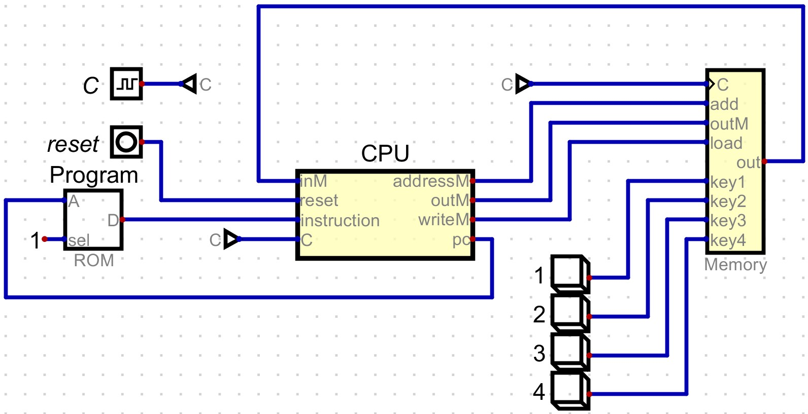
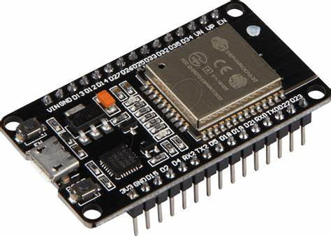

# Unidad 1
## Actividad 1
### Ejercicio 1: Investiga
- CPU (Central Processing Unit)

La CPU (Unidad Central de Procesamiento) es el componente principal de un ordenador que procesa instrucciones. Ejecuta el sistema operativo y las aplicaciones, recibiendo constantemente entradas del usuario o de programas de software activos. Procesa los datos y produce resultados, que pueden ser almacenados por una aplicación o mostrados en la pantalla.

- ALU (Arithmetic Logic Unit)

Una ALU es un circuito integrado en una CPU o GPU que realiza operaciones aritméticas y lógicas. Las instrucciones aritméticas incluyen operaciones de suma, resta y desplazamiento, mientras que las instrucciones lógicas incluyen comparaciones booleanas, como las operaciones AND, OR, XOR y NOT.

- Registros

Los registros se encuentran dentro de cada microprocesador y su función es almacenar los valores de datos, comandos, instrucciones o estados binarios que ordenan qué dato debe procesarse, como la forma en la que se debe hacer.

a. Registros de propósito general: Son registros que sirven para almacenar direcciones o datos generales. Se trata de una especie de registros mixtos que, como su propio indica, no tienen una función específica.

b. Registros de propósito específico: En esta ocasión, estamos ante registros que guardan datos del estado del sistema, como puede ser el registro de estado o el instruction pointer.

- Unidad de control

Una unidad de control (CU) es un circuito integrado en un procesador que controla la entrada y la salida. Recibe instrucciones de un programa y las transmite a la unidad aritmética lógica (ALU). La ALU realiza los cálculos apropiados y envía los valores resultantes a la unidad de control. La unidad de control envía estos valores al programa correspondiente como salida.

- Buses de datos y dirección

Los buses de datos y de dirección son componentes esenciales en la arquitectura de computadoras. El bus de datos facilita la transferencia de información digital entre la CPU, la memoria y los dispositivos de entrada/salida. Está compuesto por líneas que pueden ser de diferentes tamaños (por ejemplo, 8, 16, 32, o 64 bits) para manejar datos de distintos tipos.

Por otro lado, el bus de dirección se utiliza para enviar direcciones de memoria desde la CPU hacia la memoria principal o dispositivos de E/S. Determina la capacidad de direccionamiento de la CPU al especificar las ubicaciones exactas en la memoria donde se leen o escriben datos. Ambos buses son cruciales para asegurar una comunicación eficiente y precisa dentro de un sistema informático.

- Memoria

La memoria de un ordenador se refiere a cualquier medio que almacena datos digitales para ser accedidos y utilizados por un ordenador. El término suele referirse a la memoria del sistema principal de un ordenador, o RAM, que almacena temporalmente programas y archivos activos. Sin embargo, también puede referirse a los dispositivos de almacenamiento de un ordenador, como discos duros, unidades de estado sólido y unidades flash USB extraíbles.

- Opcode

El término "opcode" es la abreviatura de "Operational Code" (código operativo). En el contexto de la arquitectura de computadoras y programación, el opcode se refiere a una porción de un código de máquina que indica la operación que la CPU debe realizar. Es decir, es una instrucción de bajo nivel que especifica la operación fundamental que se debe realizar, como sumar dos números, cargar un valor desde la memoria, o saltar a otra parte del programa.

### Bibliografía

[https://chatgpt.com/](https://chatgpt.com/)

[https://techterms.com/](https://techterms.com/)

[https://www.profesionalreview.com/](https://www.profesionalreview.com/)

### Ejercicio 2: Simulador "*Digital*"

Se muestra un prototipo muy básico de un ordenador consistente de 4 elementos principales: la CPU, una memoria que almacena las variables que no se utilizan, una memoria ROM (Read Only Memory) y 4 botones que simulan los periféricos.

Cuando se interactúa con alguno de los 4 botones del ordenador, se despliega una ventana que llenará poco a poco todos los pixeles de la pantalla.

La interacción entre los componentes se puede resumir en tres aspectos esenciales:

- **Obtención de Instrucciones:** La CPU utiliza el contador de programa (PC) para obtener la siguiente instrucción de la ROM. La dirección de la instrucción se envía desde la CPU a la ROM, y la ROM envía la instrucción correspondiente de vuelta a la CPU.

- **Ejecución de Instrucciones:** La CPU decodifica la instrucción obtenida, lo que puede implicar realizar cálculos en la ALU, mover datos entre registros y memoria, o interactuar con dispositivos externos.

- **Interacción con Periféricos:** En la parte inferior derecha de la imagen, los interruptores numerados (1, 2, 3, 4) actúan como botones de entrada que, al ser presionados durante la simulación, envían una señal a la Memoria a través de las líneas correspondientes (key1, key2, key3, key4). La CPU puede leer estos valores desde la Memoria y ejecutar instrucciones específicas en función de la entrada recibida.

### Ejercicio 3: fetch-decode-execute

El proceso de **fetch-decode-execute** es el ciclo básico que sigue la CPU para hacer su trabajo. En el **fetch**, la CPU busca la siguiente instrucción que debe ejecutar en la memoria. Para saber dónde está esta instrucción, la CPU utiliza un marcador llamado Program Counter (PC).

Una vez que la CPU obtiene la instrucción, pasa a la etapa de decode. Aquí, la CPU desglosa y traduce la instrucción en acciones que puede entender. Es como si estuviera interpretando una receta, determinando qué debe hacer en cada paso.

Finalmente, en la etapa de execute, la CPU realiza las acciones que decodificó. Esto puede ser desde realizar un cálculo hasta mover datos. Luego de ejecutar, el ciclo comienza de nuevo con la siguiente instrucción, repitiéndose miles de veces por segundo mientras la computadora está encendida.

### Ejercicio 4: Instrucciones tipo A y C

Existen dos tipos de instrucciones básicas en el procesador empleado para su estudio, éstas son:

- **Instrucciones tipo A:** Se dan cuando el bit más significativo tiene un valor de 0. Este tipo de instrucción guarda en una memoria interna de la CPU llamada **REGISTRO A** los 15 bits más significativos de la instrucción. Esta instrucción es un valor que puede ser una constante o una dirección de memoria.

    **Ejemplo:** La instrucción @21 en lenguaje ensamblador se traduce a 0000000000010101 en binario. Esto le dice a la CPU que cargue el valor 21 en el registro A.

- **Instrucciones tipo C:** Las instrucciones tipo C son más complejas y permiten a la CPU realizar operaciones aritméticas, lógicas, o controlar el flujo del programa. Una instrucción tipo C se compone de tres partes principales: la operación a realizar, el destino del resultado de la operación, y un posible salto condicional. Esto se resume en el ciclo **Operación - Destino - Salto**.

    **Ejemplo:** Para facilitar las cosas se pone de ejemplo a la instrucción D=A. En binario, esta instrucción es 1110110000010000. Aquí, 111 indica que es una instrucción tipo C, 0110000 indica que se lee el valor del registro A, y 010 indica que el resultado debe almacenarse en el registro D. No hay un salto especificado en esta instrucción, por lo que el PC continuará con la siguiente instrucción en la secuencia.

### Ejercicio 5: Compuertas lógicas de la CPU

La CPU decodifica el tipo de instrucción (A o C) leyendo los tres bits más significativos y utilizando dos compuertas ANDs que darán como salida un uno, solo si los tres bits leídos son un '1'. Si alguno de los dos bits '14' o '13' están en '0' y el bit más significativo está en '0', entonces este valor ira hacia un negador que convertirá este valor en un '1', dando a entender que se trata de una instrucción tipo A.

### Ejercicio 6: CPU Emulator (Nand2Tetris)

En este ejercicio se descargaron las herramientas de Nand2Tetris y se utilizó el emulador de CPU Hack para ejecutar un programa en lenguaje ensamblador. 

El programa básicamente suma los números del 1 al 100 y guarda el resultado en una variable llamada sum. Al principio, se inicializó i en 1 y sum en 0. Después, se fue sumando el valor de i a sum y se fue incrementando i en cada ciclo, hasta que i superó 100. Cuando eso sucedió, el programa terminó y se quedó en un bucle infinito. El resultado final, que se almacenó en sum, fue 5050, que es la suma de los números del 1 al 100.

## Actividad 2

### Ideas Principales

1. **Mapa de Memoria y Bus de Direcciones:**
Un mapa de memoria define cómo la CPU accede a la memoria y periféricos, utilizando un bus de direcciones que determina el espacio de direcciones disponible para la CPU.

2. **Ejemplos de Microprocesadores (MC6808 y 8086):**
Se analizan los microprocesadores MC6808 y 8086, destacando sus configuraciones de memoria y el uso de buses de direcciones, incluyendo la técnica de multiplexación en el 8086 para optimizar el diseño.

3. **Comparación de Arquitecturas (Von Neumann vs. Harvard):**
Se comparan las arquitecturas de Von Neumann y Harvard, subrayando que la primera unifica la memoria para datos e instrucciones, mientras que la segunda las separa, mejorando la eficiencia del acceso.

4. **Set de Instrucciones y Arquitecturas CISC vs. RISC:**
Se presenta el set de instrucciones de un procesador, diferenciando entre las arquitecturas CISC, con instrucciones complejas, y RISC, que se enfocan en instrucciones simples para una mayor eficiencia y velocidad.

### Características de la arquitectura del ESP32 (Procesador adicional)

  

1. **Arquitectura:**
- **Tipo:** Harvard
- **Descripción:** El ESP32 utiliza una arquitectura Harvard, lo que significa que tiene memorias separadas para instrucciones y datos, y también utiliza buses separados para acceder a cada tipo de memoria. Esto permite que el procesador acceda simultáneamente a las instrucciones y los datos, lo que mejora la eficiencia.
2. **Mapa de Memoria:**

**Memoria de Instrucciones (IRAM):**

    Direcciones: 0x40000000 - 0x4005FFFF

    Descripción: Esta memoria está dedicada a almacenar instrucciones que la CPU ejecuta. En el caso del ESP32, es posible almacenar código en esta memoria.

**Memoria de Datos (DRAM):**

    Direcciones: 0x3FFB0000 - 0x3FFFFFFF
    Descripción: Este espacio de memoria se utiliza para almacenar datos temporales que el procesador necesita durante la ejecución de programas.

**Memoria ROM:**

    Direcciones: 0x40070000 - 0x4007FFFF
    Descripción: Contiene el código de arranque y las rutinas básicas que se ejecutan al iniciar el procesador.

**Memoria Flash Externa:**

    Direcciones: 0x10000000 - 0x107FFFFF
    Descripción: El ESP32 incluye una memoria flash externa que se utiliza principalmente para almacenar programas y datos persistentes. Esta memoria es más lenta que la IRAM y DRAM, pero ofrece una mayor capacidad.

**Periféricos:**

    Direcciones: 0x60000000 - 0x600FFFFF
    Descripción: Este segmento de direcciones está asignado a periféricos conectados al procesador, permitiendo la interacción con dispositivos de entrada/salida, como puertos GPIO, UART, I2C, entre otros.

### Comparación de instrucciónes en 3 microprocesadores

 Las especificaciones de las instrucciones ADD, MOV, y JMP en los microprocesadores Intel 8086, ARM Cortex-M4, y MIPS32 son:

**ADD:**

    Intel 8086: Tamaño variable (2-4 bytes), 1-3 ciclos de reloj, realiza la suma de registros o memoria.
    ARM Cortex-M4: Tamaño fijo (4 bytes), 1 ciclo de reloj, realiza la suma de registros.
    MIPS32: Tamaño fijo (4 bytes), 1 ciclo de reloj, realiza la suma de registros.
**MOV:**

    Intel 8086: Tamaño variable (2-3 bytes), 2 ciclos de reloj, mueve datos entre registros o entre registro y memoria.
    ARM Cortex-M4: Tamaño fijo (4 bytes), 1 ciclo de reloj, mueve datos entre registros.
    MIPS32: Tamaño fijo (4 bytes), 1 ciclo de reloj, mueve datos entre registros.
**JMP:**

    Intel 8086: Tamaño variable (3-4 bytes), 15 ciclos de reloj, salta a una dirección específica.
    ARM Cortex-M4: Tamaño fijo (4 bytes), 2 ciclos de reloj, salta a una dirección específica.
    MIPS32: Tamaño fijo (4 bytes), 1 ciclo de reloj, salta a una dirección específica.